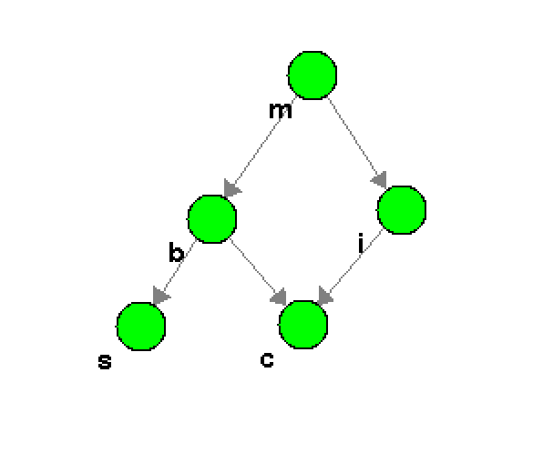

# COMP3308 Assignment 2

## Question 1

**a) Construct and show the equivalent graphical model**

The Bayesian Network for this relationship can be shown below:

Where:

$$$m$$$ - Metastatic Cancer;

$$$b$$$ - Brain Tumor;

$$$i$$$ - Increased Serum Calcium;

$$$c$$$ - Coma and

$$$s$$$ - Severe Headaches

**b) What is the prior probability of coma $$$P(C)$$$?**

The prior probability of Coma is:

$$
P(C) = 0.296
$$

and therefore:

$$
P(\neg C) = 0.704
$$

**c) What is the probability of metastatic cancer given the patient has severe headaches and has not fallen into a coma?**

The probability of metastatic cancer given the patient has severe headaches and has not fallen into a coma is:

$$
P(M | S = true ,C = false) = 0.102
$$

**d) What is the Markov Blanket of Coma?**

$$$C$$$ has no child nodes, therefore the Markov Blanket for $$$C$$$ is the parent nodes of $$$C$$$, $$$B$$$ and $$$I$$$.

**e) Are increased total serum calcium and brain tumor independent given coma? Explain.**

TODO

**f) What is the probability of fallen into a coma given the patient has metastatic cancer?**

The probability that a patient is in a coma given they have metastatic cancer is:

$$
P(C| m = true) = 0.206
$$
