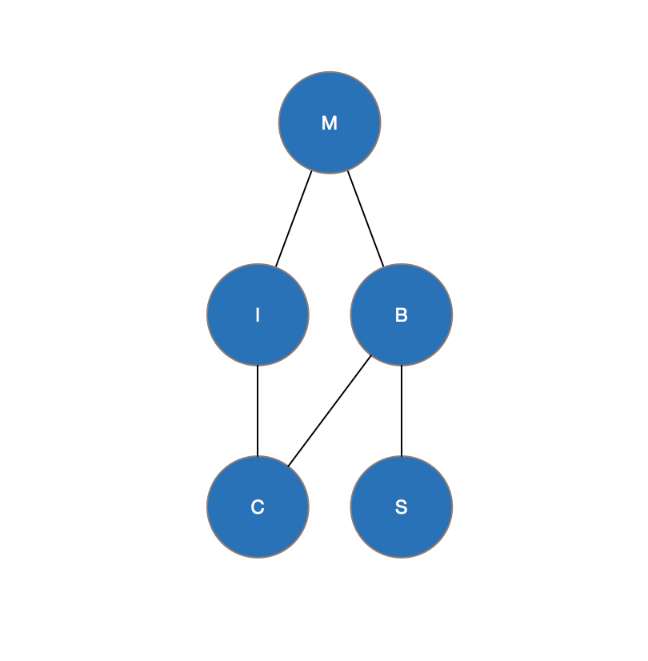
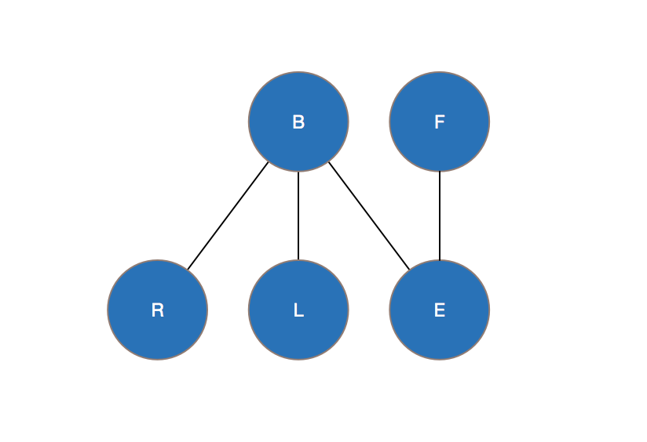

# COMP3308 Assignment 2

## Question 1

**a) Construct and show the equivalent graphical model**

The Bayesian Network for this relationship can be shown below:

Where:

\\(m\\) - Metastatic Cancer;

\\(b\\) - Brain Tumor;

\\(i\\) - Increased Serum Calcium;

\\(c\\) - Coma and

\\(s\\) - Severe Headaches

**b) What is the prior probability of coma \\(P(C)\\)?**

The prior probability of Coma is:

$$
P(C) = 0.296
$$

and therefore:

$$
P(\neg C) = 0.704
$$

**c) What is the probability of metastatic cancer given the patient has severe headaches and has not fallen into a coma?**

The probability of metastatic cancer given the patient has severe headaches and has not fallen into a coma is:

$$
P(M | S = true ,C = false) = 0.102
$$

**d) What is the Markov Blanket of Coma?**

\\(C\\) has no child nodes, therefore the Markov Blanket for \\(C\\) is the parent nodes of \\(C\\), \\(B\\) and \\(I\\).

**e) Are increased total serum calcium and brain tumor independent given coma? Explain.**

Any node is conditionally independent of its children given its parents. Therefore, as Increased Serum Calcium (\\(I\\)) and Brain Tumor (\\(I\\)) have Coma (\\(C\\)) as a common child, they are not independent, \\(C\\) relies on the inputs of \\(I\\) and \\(B\\).

**f) What is the probability of fallen into a coma given the patient has metastatic cancer?**

The probability that a patient is in a coma given they have metastatic cancer is:

\\(P(C| m = true) = 0.206\\)

## Question 2

**a)**

Show that the equation:

\\(
P(C, X_i,..., X_n) = P(C) \prod_{i=1}^{n}P(x_i|c)
\\)

Satisfies the independence assumption of the graph which is that:\\(X_i,...,X_n
\\)are *conditionally independent* given \\(C\\).

*Intuitvely, this works because there are no edges connecting each child node of \\(C\\) - Not really sure how to proceed with this one.*

**b)**

## Question 3

**a) List your random variables, explain the meaning of each, etc...**

For this network, we have decided to model a car system. There are six random variables that are to be included, these are:

**Battery** \\(B\\) - The state of the battery, it can have three possible states: *high*, *medium* or *low*. Prior probabilities of \\(B\\) are as follows:

$$P(B = high) = 0.5$$
$$P(B = low) = 0.35$$
$$P(B = empty) = 0.15$$

**Radio** \\(R\\) - The state of the radio, it can have two possible states: *on* or *off*. Conditional probabilities of \\(R\\) are as follows:

$$P(R | B = high) = 0.383$$
$$P(R | B = low) = 0.27$$
$$P(R | B = empty) = 0.115$$

**Lights** \\(L\\) - The state of the lights of the car, it can have three possible states: *bright*, *dim* or *off*. Conditional probabilities of \\(L\\) are as follows:

$$P(L = bright | B = high) = 0.8$$
$$P(L = dim | B = high) = 0.1$$
$$P(L = off | B = high) = 0.1$$

$$P(L = bright | B = low) = 0.4$$
$$P(L = dim | B = low) = 0.5$$
$$P(L = off | B = low) = 0.1$$

$$P(L = bright | B = empty) = 0$$
$$P(L = dim | B = empty) = 0$$
$$P(L = off | B = empty) = 1$$

**Engine** \\(E\\) - The state of the engine, it can have two possible states, either *on* or *off*. Conditional probabilities of \\(E\\) are as follows:

$$P(E | F = high, B = high) = 0.86$$
$$P(E | F = high, B = low) = 0.09$$
$$P(E | F = high, B = empty) = 0.05$$

$$P(E | F = low, B = high) = 0.8$$
$$P(E | F = low, B = low) = 0.18$$
$$P(E | F = low, B = empty) = 0.02$$

$$P(E | F = empty, B = high) = 0.02$$
$$P(E | F = empty, B = low) = 0.01$$
$$P(E | F = empty, B = empty) = 0$$

**Fuel** \\(F\\) - The state of the fuel in the car, it can have three possible states, either *high*, *low*, or *empty*. Prior probabilities of \\(F\\) are as follows:

$$P(F = high) = 0.624$$
$$P(F = low) = 0.192$$
$$P(F = empty) = 0.184$$

**b) Explain the methodology used to construct such a network**

When beginning to construct the network, we decided on the Random Variables that would be needed, as indicated in part a of this question. The set of these variables, denoted by \\(S\\) is shown below.

$$
S = {B, L, R, E, F, G}
$$

We then decided on sensible conditional and prior probabilities for these random variables. To construct the graph, from each random variable in \\(S\\) we had to select a minimal set of parents that satisfy:

$$
P(X_i| X_{i-1},...,X_1) = P(X_i | Parents(X_i))
$$

This then resulted in the network that can be seen in *part a*. When selecting the values for conditional probabilities of each node, we had to make sure the independence assertion still held true.

Finally, we used `JavaBayes` to visualise and check our working and assumptions.

